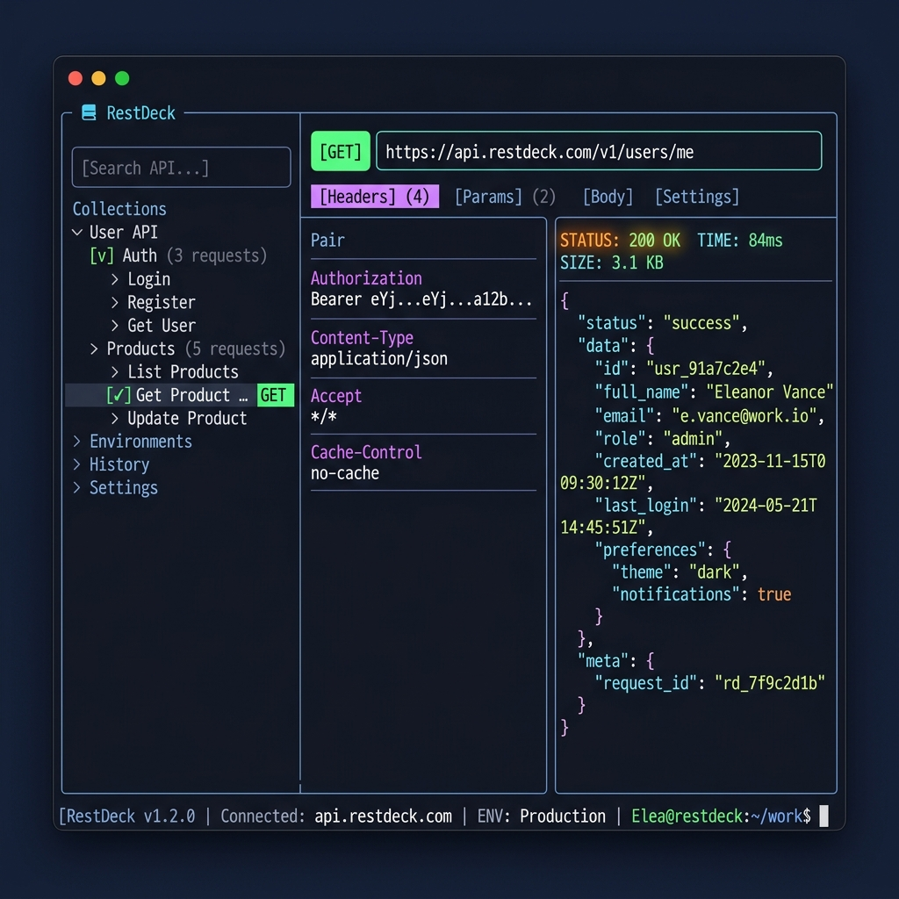

# 🎛️ RestDeck

RestDeck is a lightweight, keyboard-driven **REST API client TUI** (Terminal User Interface) built in Rust using **Ratatui** and **Tokio**. It brings the features of Postman and Insomnia directly into your terminal, giving you near-instant startup, negligible memory overhead, and fluid visual feedback.



---

## ✨ Features

*   **Keyboard-Driven Flow:** Fully navigate, edit, and send requests without lifting your fingers from the home row.
*   **Split Sidebar UI:** Easily navigate requests and environment configurations in a structured layout.
*   **Environment Switcher:** Configure variable blocks (like `baseUrl`, tokens) and interpolate them dynamically using `{{variable}}` placeholders.
*   **Asynchronous Client:** Requests run on background tokio tasks, meaning the TUI remains responsive and fluid during slow network calls.
*   **Local State Persistence:** All edits, variables, and request configs are auto-saved to disk and restored instantly upon restarting.
*   **Git-Friendly Collections:** Place configurations in your workspace (`restdeck.json`) to commit and share API endpoints with your team.

---

## ⌨️ Keyboard Shortcuts

| Shortcut | Description |
| :--- | :--- |
| `Tab` / `Shift-Tab` | Cycle focus between panels (Sidebar -> URL -> Config Tabs -> Response) |
| `Ctrl-E` | Trigger/Send the HTTP request |
| `Ctrl-M` | Cycle HTTP Methods (`GET` ➔ `POST` ➔ `PUT` ➔ `DELETE` ➔ `PATCH`) |
| `Ctrl-H` / `Ctrl-P` / `Ctrl-B` | Switch request config tab to **Headers**, **Params**, or **Body** |
| `Up` / `Down` (or `j`/`k`) | Navigate Sidebar selections or scroll Response body |
| `Enter` | (In Sidebar) Navigate to URL input for Requests, or toggle/activate Environments |
| `Esc` / `Ctrl-C` | Exit RestDeck |

---

## ⚙️ Environment Variables

RestDeck supports dynamic value replacements. Define environment variables in `key=value` lines:
```ini
baseUrl=https://httpbin.org
apiKey=dev_token_123
```
Then, reference them in request fields (URL, headers, query params, body) using double curly braces:
*   `{{baseUrl}}/json` ➔ `https://httpbin.org/json`
*   `Authorization: Bearer {{apiKey}}` ➔ `Authorization: Bearer dev_token_123`

To toggle/activate an environment, highlight it in the sidebar and press `Enter`. The active environment is denoted by a solid green dot (`●`) and displayed in the bottom status bar.

---

## 💾 State Persistence

RestDeck saves configuration to disk in JSON format automatically. It resolves paths in the following priority:
1.  **Local Workspace Config (`./restdeck.json`):** Checks your current working directory first. If found, it reads/writes locally (great for committing collections to git repositories).
2.  **Global Config (`~/.config/restdeck/collections.json`):** Fallback path in your home directory for personal workspace collections and private secrets.

---

## 🚀 Installation & Running

### Prerequisites
Make sure you have Rust and Cargo installed:
*   [Install Rust](https://www.rust-lang.org/tools/install)

### Building from Source

1.  Clone the repository:
    ```bash
    git clone https://github.com/<your-username>/restdeck.git
    cd restdeck
    ```
2.  Build the binary:
    ```bash
    cargo build --release
    ```
3.  Run the application:
    ```bash
    ./target/release/restdeck
    ```
    *(Or simply run `cargo run` in development mode)*

### Running tests
```bash
cargo test
```

---

## 📄 License
This project is licensed under the MIT License. See the [LICENSE](LICENSE) file for details.
